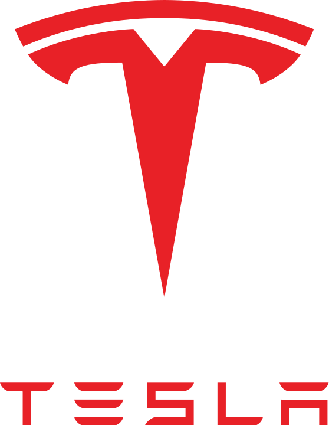

  

<h1 align="center">Hi 👋  I'm Johnny Stouffer</h1>

  

## 👨🏻‍💻 About Me  

I’m a **CS senior at Michigan State University** who loves building. Currently, I’m developing **Odyssey Maps**, **FocusTube**, and other projects. Currently trying to self learn **Computer Vision** and **Computer Graphics** on the side.

## 💼 Experience

<table>
  <tr>
    <td align="center" width="33%">
       
      <b>Software Engineering Intern</b> 
      Collins Aerospace • Summer 2025 
      → Built real-time GPS filtering + predictive mapping
    </td>
    <td align="center" width="33%">
       
      <b>Software Intern</b> 
      Tesla • Summer 2024 
      → Automated KPI dashboards + data pipelines
    </td>
    <td align="center" width="33%">
       
      <b>Teaching Assistant</b> 
      Michigan State University • 2025 
      → Supported 300+ students in DS & Algos
    </td>
  </tr>
</table>

---

## 🚀 Featured Projects

  

    <a href="https://odysseymaps.com">
       
      <b>Odyssey Maps</b>
    </a> 
    React + Spring Boot + PostgreSQL 
    Track Mario Odyssey progress across 15 kingdoms
  

  

    <a href="https://focus-youtube.vercel.app/">
       
      <b>FocusTube</b>
    </a> 
    Next.js + Tailwind + YouTube API 
    Distraction-free YouTube wrapper
  

---

<h2 align="center">🛠️ Languages and Tools</h2>

  <!-- Languages -->
  
  
  
  
  
  
  
  
  

  <!-- Frameworks -->
  
  
  
  
  
  
  
  
  

  <!-- Tools -->
  
  
  
  
  
  

  <!-- ML & Data -->
  
  
  
  
  
  
  

<h2 align="center">🌐 Let's Connect</h2>

  
  

  

