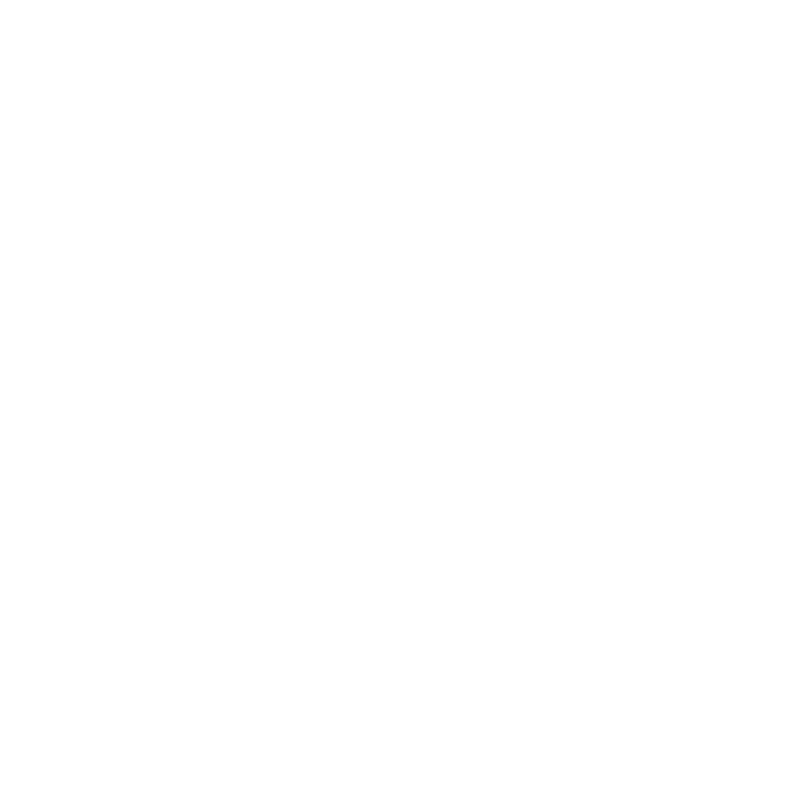
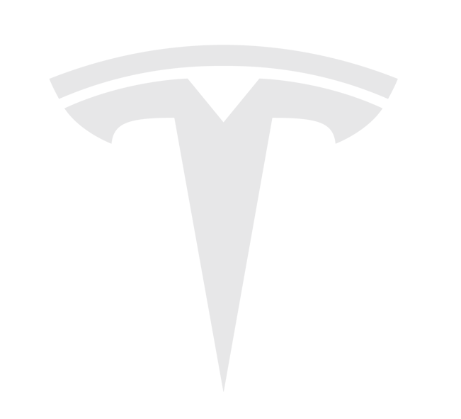

  

<h1 align="center">Johnny Stouffer</h1>

<h3 align="center">Hello!</h3> 

I'm a <b>Software Engineer I</b> at <b>Collins Aerospace</b> that works on mainly <b>Embedded Systems in C++</b>.

On the side I occassionally like to make Weekend project, which is usually <b>Full Stack Development</b> using <b>React</b> and various backend frameworks <b>(Spring Boot, Flask, Django, etc.)</b>

<h2 align="center">Experience</h2>

  
  &nbsp;&nbsp;<b>Software Engineer I</b>
   
  Collins Aerospace &nbsp;•&nbsp; Present
   
  Working on real-time mission system technology

  
  &nbsp;&nbsp;<b>Software Engineering Intern</b>
   
  Collins Aerospace &nbsp;•&nbsp; Summer 2025
   
  Built real-time GPS filtering + predictive mapping

  
  &nbsp;&nbsp;<b>Software Intern</b>
   
  Tesla &nbsp;•&nbsp; Summer 2024
   
  Automated KPI dashboards + data pipelines

  
  &nbsp;&nbsp;<b>DSA Teaching Assistant</b>
   
  Michigan State University &nbsp;•&nbsp; '25 - '26
   
  Supported 300+ students in DSA

<h2 align="center">Projects</h2>

  
  &nbsp;&nbsp;<a href="https://odysseymaps.com"><b>Odyssey Maps</b></a>
   
  React • Spring Boot • PostgreSQL
   
  Track Mario Odyssey progress across 15 kingdoms

  
  &nbsp;&nbsp;<a href="https://focus-youtube.vercel.app/"><b>FocusTube</b></a>
   
  Next.js • Tailwind • YouTube API
   
  Distraction-free YouTube wrapper

<h2 align="center">Languages and Tools</h2>

  <!-- Languages -->
  
  
  
  
  
  
  

  <!-- Frameworks -->
  
  
  
  
  
  
  

  <!-- Tools -->
  
  
  
  
  

  <!-- AI Tools -->
  
  

<h2 align="center"> Reach Out! </h2>

  
  

  

